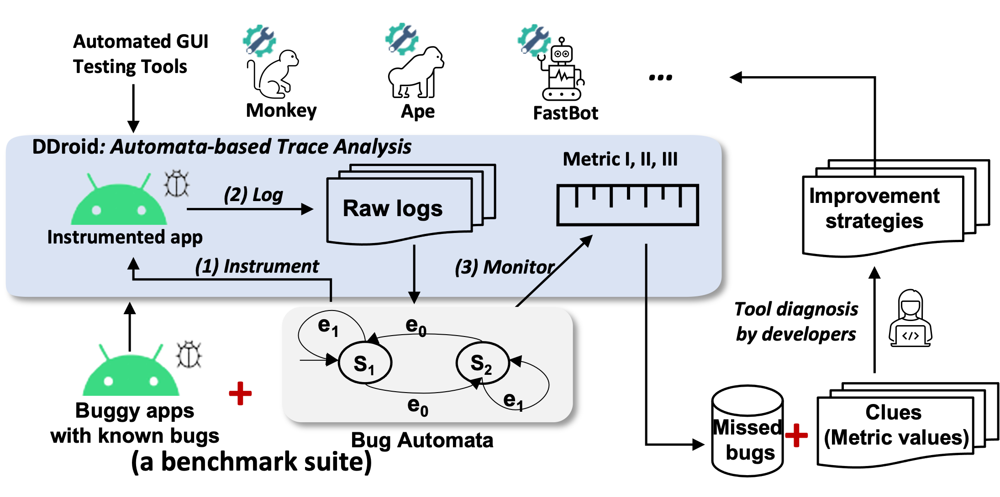
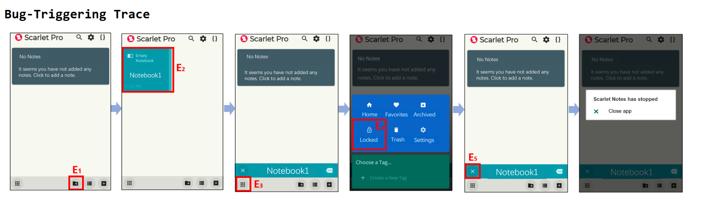
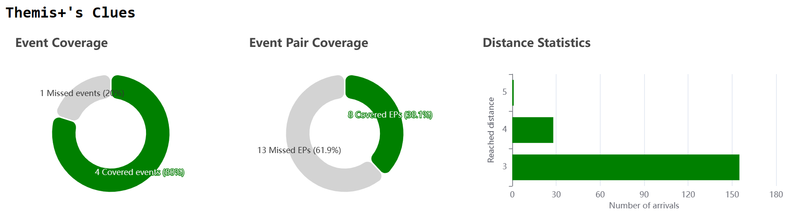
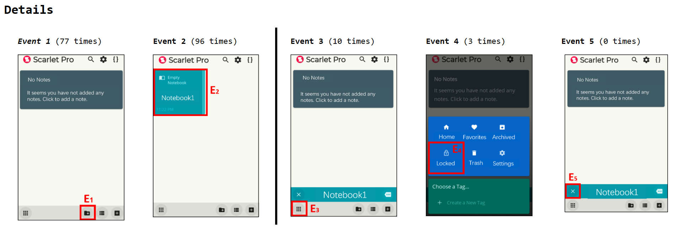
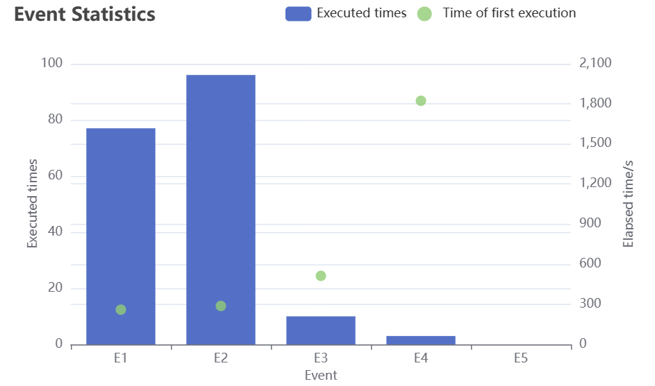
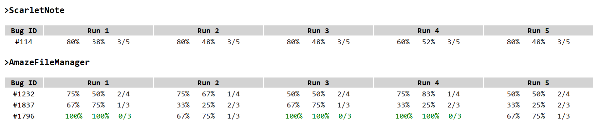

# Replication Package

This replication package includes all the artifacts in Themis+, i.e., the instrumented bugs and their bug automata, the source code of DDroid, and the app instrumentation tool ([DDroid-instrumentator](https://github.com/DDroid-Android/Android_Instrumentation)).


Themis+ is a benchmark suite, enhanced by DDroid (an automata-based trace analysis approach) for aiding diagnosing automated GUI testing tools for Android against the missed bugs. Specifically, it helps find the clues of potential tool weaknesses on the basis of three automata-based coverage metrics. Themis+ is built on top of Themis, a representative benchmark suite of real-world Android app bugs.

<div align="center">
    
</div>

## 1. Contents of Themis+

Themis+ contains 47 real-world bugs from Themis.

The directory structure of Themis+ is as follows:

    Themis+
        |
        |--- ddroid-core: the script to match the logged event traces against the bug automaton to compute the three coverage metrics
            |
            |--- templates: templates for visualizing Themis+'s clues
                |
                |--- basetmpl.html
                |--- resulttmpl.html
                |--- summarytmpl.html
                |
            |--- analyze.py: the script analyzing the event logs
            |--- convert.py: the script converting one .jff file to .json file
            |--- dfa.py: the script defining the DFA in python class format
            |--- display.py: the script for display Themis+'s clues
            |--- dtypes.py: the script defining data structures or classes required in DDroid
            |--- error.py: the script defining the expection types
            |--- main.py: the main script to run automaton-based trace analysis (DDroid)
            |--- utils.py: the script defining some auxiliary functions
        |
        |--- scripts:                    scripts for running testing tools (borrowed from Themis) and analyzing the testing results 
            |
            |--- *themis.py*:            the main script for deploying different GUI testing tools on the instrumeted apps to log relevant event traces     
            |
            |--- check_crash.py:         the script to check whether a tool find the bugs.
            |
            |--- run_monkey.sh           the internal shell script to run Monkey
            |--- run_ape.sh              the internal shell script to run Ape
            |--- run_humanoid.sh         the internal shell script to run Humanoid
            |--- run_qtesting.sh         the internal shell script to run Q-testing
            |--- run_combodroid.sh       the internal shell script to run Combodroid
            |--- run_weighted.sh         the internal shell script to run Stoat (its weighted strategy)
            |--- run_wetest.sh           the internal shell script to run WCTester
            |--- run_fastbot.sh          the internal shell script to run FasttBot
            |
        |--- app_1:                            The bugs collected from app_1.
            |  
            | --- xxx-NFA.jff                 The epsilon-NFA for the bug with id xxx
            | --- configuration-xxx.json      The configuration file for the bug with id xxx
            | --- crash_stack_xxx.txt         The crash trace for the bug with id xxx
            | --- instrumented-xxx.apk        The instrumented APK for the bug with id xxx
            | --- script-xxx.py               The bug-triggering trace in the form of uiautomator script for the bug with id xxx
            | --- video-xxx.mp4               The bug-reproducing video for the bug with id xxx
        |
        |--- app_2:                            The bugs collected from app_2.
        |
        |--- ...
        |
        |--- app_N                             The bugs collected from app_n.

## 2. Instructions for using Themis+

Before using Themis+, you need to install Android SDK and emulators. Then you can follow the steps below to run Themis+.

**Step 1. open a terminal and switch to the scripts directory**

```
cd scripts/
```

**Step 2. run Monkey on one target bug for 6 hours**

```
python3 themis.py --no-headless --avd Android7.1 --apk ../ActivityDiary/instrumented-Scarlet-Notes-#114.apk --time 6h -o ../monkey-results/ --monkey
```

Here, 
* `--no-headless` shows the emulator GUI. 
* `--avd Android7.1` specifies the name of the emulator (which has already been created in the VM).
* `--apk ../Scarlet-Notes/instrumented-Scarlet-Notes-#114.apk` specifies the target bug which is `ScarletNotes`'s bug `#114` in `v1.1.8`.
* `--time 6h` allocates 6 hours for the testing tool to find the bug 
* `-o ../monkey-results/` specifies the output directory of testing results
* `--monkey` specifies the testing tool

**Step 3. run the analysis script to analyze the effectiveness of Monkey**

First, we need to change the cwd to `/home/ddroid-core`:

```
cd ../ddroid-core/
```

* To analyze one single round of testing results which is outputted under `../monkey-results/`:

```
python3 main.py ../monkey-results/instrumented-Scarlet-Notes-#114.apk.monkey.result
```

Here, `../monkey-results/instrumented-Scarlet-Notes-#114.apk.monkey.result` is generated by **Step 2**


* To analyze multiple rounds of testing results which are outputted under `../monkey-results/`:

```
python3 main.py -b ../monkey-results/
```

Here, 
* `-b` (`--batch`) is used to output the all detailed coverage statistics in terms of event coverage, event-pair coverage and trace-based minimal distance under a specific directory
* Use `-v` option to generate html format clues

## 3. Themis+'s clues

### **Textual Report**

A example textual coverage report (this is the example report from `instrumented-Scarlet-Notes-#114.apk` ran by FastBot):

```
***********************************[ ScarletNote-#114 (fastbot) ]***********************************
----------------------------------[ The statistics of each event ]----------------------------------
          [ #114 ] Event 1/5:  77-0  . (0:04:20/6:00:00)
              > Event info: Created a new notebook.
          [ #114 ] Event 2/5:  96-0  . (0:04:48/6:00:00)
              > Event info: Entered a notebook.
          [ #114 ] Event 3/5:  10-0  . (0:08:33/6:00:00)
              > Event info: Clicked the "X" icon on the left bottom to close the notebook.
          [ #114 ] Event 4/5:   3-0  . (0:30:23/6:00:00)
              > Event info: Clicked the "Locked" option in the main menu.
          [ #114 ] Event 5/5:   0-0  . (None/6:00:00)
              > Event info: Clicked the menu on the left bottom.
----------------------------------------[ Themis+'s clues ]----------------------------------------
                    Event Coverage(%)     Event-Pair Coverage(%)    Min Distance
          [ #114 ]    4/5 (80.00%)            10/21(47.62%)               3
***************************************[ Analysis finished ]***************************************
```

We can also get a brief overview of the three metrics using Themis+.

```
[Scarlet-Notes]
    [#114] ['60.00% / 38.10% / 3 / False', '80.00% / 47.62% / 3 / False', '80.00% / 52.38% / 3 / False', '80.00% / 47.62% / 3 / False', '80.00% / 47.62% / 3 / False']
    [#114-best] 80 & 52 & 3
```

---

### **HTML Report**

We can inspect the clues in a HTML report (which can be viewed on a browser) by the option `-v` (see an example report below)
```
python3 main.py ../monkey-results/instrumented-Scarlet-Notes-#114.apk.monkey.result -v
```


**Bug-Triggering Trace**

The figure below gives the minimal bug-triggering trace of `ScarletNote-#114`. The pivot events are highlighted by the red boxes.

<div align="center">
    
</div>


**Themis+'s Clues**

The figure below gives the three coverage-based clues.

- *Event coverage* (EC) computes how many events are covered or missed. In this case of `ScarletNote-#114`, its EC is `80%`.

- *Event-Pair Coverage* (EPC) computes how many event pairs are covered or missed. In this case of `ScarletNote-#114`, its EPC is `38.1%`.

- *Trace-based minimal distance* (MD) computes how close a testing tool can reach a bug. It uses the number of pivot events to characterize the distance. Here, *Distance Statistics* computes all the reached distances between any reached state and the final state (i.e., the crashing state).  The distances are sorted from the largest to the smallest. In this case of `ScarletNote-#114`, the minimal distance is `3`. The number of arrivals (reached times) of the `3`-minimal distance is over `150`.

<div align="center">
    
</div>

**Details of Clues**

The figure below gives the execution times of pivot events and the minimal distance. 
- The execution times of pivot events is given next to the event ID. Specifically, `Event 1 (77 times)` indicates that $E_1$ was executed `77` times;  `Event 2 (96 times)` indicates that $E_2$ was executed `96` times; `Event 3 (10 times)` indicates that $E_3$ was executed `10` times; `Event 4 (3 times)` indicates that $E_4$ was executed `3` times; `Event 5 (0 times)` indicates that $E_5$ was executed `0` times. 
- The *black vertical line* denotes that the minimal distance is `3`. It indicates that Fastbot can only execute the event sequence < $E_1$, $E_2$ > in order.

<div align="center">
    
</div>

The figure below gives the detailed execution statistics of pivot events. The left axis gives the execution times of pivot events (`Execution times`, in the blue column graph), and the right axis gives the elapsed time when each pivot event was executed at the first time (`Time of first execution`, in the green dotted graph).

<div align="center">
    
</div>

**Batch Analysis**

The figure below gives the summary report when the option `-b` (`--batch`) is given. The green entry means that the testing tool *triggered* the bug in the corresponding run. Each entry gives `event coverage`, `event-pair coverage` and `trace-based minimal distance`. The black entry means the testing tool *missed* the bug in the corresponding run.

<div align="center">
    
</div>


